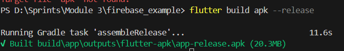

# FireBase - FireBase Firestore - Create simple project takes some info from user and display it

A Flutter project that demonstrates the integration of Firebase with a simple input form and data display functionality.

## Getting Started

This project is a starting point for a Flutter application with Firebase integration.

### Features

- **Firebase Initialization**: The project initializes Firebase using the configuration provided in `firebase_options.dart`.
- **Input Form**: A form with three input fields (name, age, and favourite hobby) and two buttons (save data and view data).
- **Data Storage**: The input data is saved to Firebase Firestore.
- **Data Display**: A separate page to view and display the saved data from Firestore.

### Dependencies

- `firebase_core`: ^3.10.1
- `cloud_firestore`: ^5.6.2
- `flutter`: sdk: flutter
- `cupertino_icons`: ^1.0.8

### Project Structure

- `main.dart`: Initializes Firebase and sets up the main application.
- `input_form_page.dart`: Contains the input form and logic to save data to Firestore and navigate to the data display page.
- `view_data_page.dart`: Displays the saved data from Firestore.

### How to Run

1. Ensure you have Flutter and Dart installed.
2. Add your Firebase configuration in `firebase_options.dart`.
3. Run `flutter pub get` to install dependencies.
4. Use `flutter run` to start the application.

### Screenshots

 

### Data on firebase


### App distribution on firebase 
#### Generate APK build for android by running this command in CMD
```sh
    flutter build apk --release
```


Add the generated build in firebase distribution and add a test message for beta testers 


### Project App ID on firebase and in my google-services.json file


